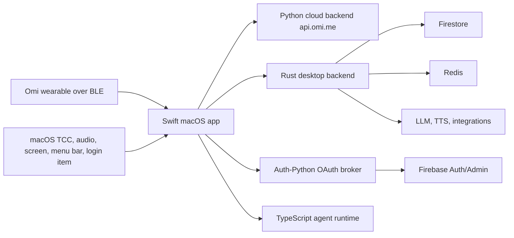

# Omi Desktop Architecture

## Process Model

The Swift app is the user-facing host. It owns windows, menu bar state, permissions, local capture, BLE, local persistence, and Sparkle update checks.

The Rust backend is an HTTP service, not an in-process library. Swift reaches it through `OMI_API_URL` for desktop-specific routes such as API key config, agent VM provisioning, Crisp, TTS proxy, and update metadata.

Auth-Python is the local development OAuth broker. Swift reaches it through `OMI_AUTH_URL`, then exchanges provider auth codes for Firebase custom tokens and ID tokens.

The Python cloud backend is the source of truth for conversation and user data APIs used by desktop. Swift reaches it through `OMI_PYTHON_API_URL`, including `/v4/listen` and `/v2/voice-message/*`.

## Swift Host

Primary entry points:

- `Desktop/Sources/OmiApp.swift` - `@main` app, `AppDelegate`, menu bar, launch, URL callbacks, Sparkle initialization, legacy bundle cleanup.
- `Desktop/Sources/AppState.swift` - recording lifecycle, audio capture, transcription wiring, device coordination, permission state.
- `Desktop/Sources/APIClient.swift` - HTTP client for Python and Rust backends.
- `Desktop/Sources/AuthService.swift` - OAuth browser flow, Firebase custom token exchange, token persistence, auth state.
- `Desktop/Sources/TranscriptionService.swift` - WebSocket and REST transcription calls to the Python backend.
- `Desktop/Sources/ScreenCaptureService.swift` - ScreenCaptureKit, CoreGraphics TCC preflight/request, AX window lookup, recovery paths.
- `Desktop/Sources/Bluetooth/` and `Desktop/Sources/Providers/DeviceProvider.swift` - CoreBluetooth scan/connect, device abstractions, reconnects, fall detection.
- `Desktop/Sources/FloatingControlBar/` - floating bar, PTT, screenshots, voice playback, notifications.
- `Desktop/Sources/Rewind/` - local timeline database, screenshots, indexing, and timeline UI.

## Swift To Rust Boundary

There is no Swift-to-Rust FFI boundary in the inspected desktop code. The boundary is HTTP:

- Swift reads `OMI_API_URL`.
- `APIClient.rustBackendURL` normalizes that URL.
- Rust exposes Axum routes under `Backend-Rust/src/routes/`.

Do not change route paths, request bodies, response bodies, or auth requirements without treating it as an IPC contract change.

## Auth Flow

1. Swift opens `OMI_AUTH_URL/v1/auth/authorize/{provider}` with a generated state.
2. Auth-Python redirects to Google or Apple.
3. Provider redirects back to Auth-Python.
4. Auth-Python returns the app URL callback, for example `omi-computer-dev://auth/callback?...`.
5. `AppDelegate` passes the callback to `AuthService`.
6. `AuthService` exchanges the code for a Firebase custom token, then an ID token and refresh token.
7. Tokens are persisted in Keychain; non-token auth display state remains in `UserDefaults`.

## BLE Flow

1. `BluetoothManager` owns `CBCentralManager` and posts connection notifications.
2. `DeviceProvider` scans, pairs, reconnects, and creates typed `DeviceConnection` instances.
3. `BleTransport` wraps `CBPeripheral` reads, writes, notifications, RSSI ping, and connection state.
4. Device-specific connection classes parse battery, audio, accelerometer, Wi-Fi sync, and feature data.
5. `AppState` consumes audio streams and forwards chunks to transcription.

The reconnect path depends on bounded BLE operations. Connect, service discovery, read, write, and ping must not wait forever for CoreBluetooth callbacks.

## Cloud Endpoints Consumed By Swift

Python backend (`OMI_PYTHON_API_URL`):

- `/v4/listen` WebSocket for conversation capture.
- `/v2/voice-message/transcribe-stream` WebSocket for PTT live transcription.
- `/v2/voice-message/transcribe` REST for PTT batch transcription.
- User data, conversations, memories, tasks, goals, subscriptions, payments, and usage APIs.

Rust backend (`OMI_API_URL`):

- `/v1/config/api-keys`
- `/v1/tts/synthesize`
- `/v1/agent/*`
- `/v2/desktop/appcast.xml` / `/appcast.xml`
- `/updates/latest`, `/updates/releases`, `/updates/releases/promote`
- Crisp, integrations, local test subscription, and desktop-specific proxy routes.

Auth backend (`OMI_AUTH_URL`):

- `/v1/auth/authorize/google`
- `/v1/auth/authorize/apple`
- `/v1/auth/callback/google`
- `/v1/auth/callback/apple`
- `/v1/auth/token`

## Auto-Update Flow

Sparkle is configured in `Desktop/Info.plist` with `SUFeedURL` and `SUPublicEDKey`. Runtime channel logic lives in `AppBuild.swift` and `UpdaterViewModel.swift`.

Release metadata lives in Firestore via the Rust update routes:

1. CI builds, signs, notarizes, and uploads the app artifacts.
2. CI registers release metadata with `POST /updates/releases` and `X-Release-Secret`.
3. Rust emits Sparkle appcast XML from live release metadata.
4. Sparkle validates the EdDSA signature and installs eligible updates.
5. Channel promotion uses `PATCH /updates/releases/promote`.

Release metadata must be XML-safe. Bad appcast XML blocks update checks for every client on that feed.

## Permissions Model

Desktop relies on macOS TCC grants:

- Screen Recording for ScreenCaptureKit/CoreGraphics capture.
- Microphone and system audio capture for transcription.
- Accessibility/AppleEvents for active app and window context.
- Bluetooth for wearable devices.
- Notifications for proactive assistant and device alerts.

Screen Recording has two common failure modes: TCC says denied, or TCC says granted while ScreenCaptureKit is stale/broken after rebuild, update, or stale LaunchServices registration. Recovery should re-register the installed app bundle, re-request ScreenCaptureKit when possible, and only reset TCC when the user explicitly chooses the hard reset path.

## Local Persistence

Swift uses local stores for Rewind, staged data, and UI/auth metadata. Auth tokens live in Keychain. User-visible metadata may live in `UserDefaults`. Rewind and storage sync code own their own migration paths; schema changes should include a focused migration and a test when an existing test target covers the store.
