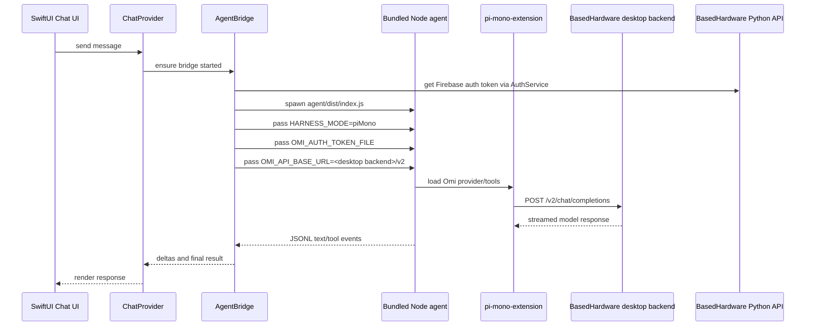
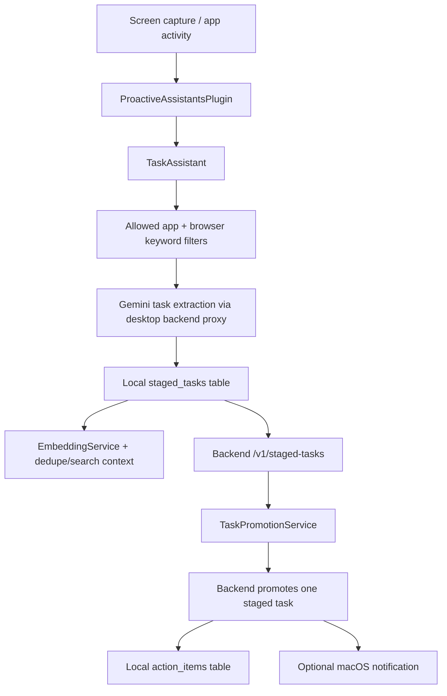

# Desktop AI, Browser, And Tasks

This document describes the macOS desktop app internals for Adam's fork. The normal local install is a signed `Omi Dev.app` that runs on this Mac while using BasedHardware's hosted services.

## Backend Invariant

For Adam's local desktop builds, keep these hosted endpoints:

```bash
OMI_DESKTOP_API_URL=https://desktop-backend-hhibjajaja-uc.a.run.app
OMI_PYTHON_API_URL=https://api.omi.me
```

`OMI_PYTHON_API_URL` is the primary Python API for auth, transcription, subscription state, conversations, tasks, and most user data. `OMI_DESKTOP_API_URL` points at the desktop Rust backend service and is used for desktop-only proxy routes such as config keys, agent status, and `/v2/chat/completions`.

Do not route Adam's normal local build to a personal backend, tunnel, or fork backend unless the task is explicitly backend development.

## Local Install Shape

`desktop/macos/run.sh --yolo` builds and installs:

```text
/Applications/Omi Dev.app
  Contents/MacOS/Omi Computer
  Contents/Resources/.env
  Contents/Resources/Omi Computer_Omi Computer.bundle/
    node
    ffmpeg
    app images, videos, audio, and model assets
  Contents/Resources/agent/
    dist/index.js
    package.json
    node_modules/
  Contents/Resources/pi-mono-extension/
    index.ts
    package.json
```

The app is signed with Adam's local Developer ID identity when available. `node` is signed separately with `desktop/macos/Desktop/Node.entitlements` because V8 needs the hardened-runtime JIT entitlement.

## Node Runtime Packaging

The desktop AI bridge is a Swift process that spawns Node.js. A shell-launched app may find `node` on the shell `PATH`, but a Finder-launched signed app usually cannot. Therefore local install must package a Node executable into the SwiftPM resource bundle.

The local runner now does this before the Swift build:

```bash
cd desktop/macos
bash scripts/prepare-node-resource.sh
xcrun swift build -c debug --package-path Desktop
```

`scripts/prepare-node-resource.sh` writes an ignored local artifact:

```text
desktop/macos/Desktop/Sources/Resources/node
```

The script discovers Node in this order:

1. `OMI_NODE_SOURCE`, when explicitly set.
2. `node -p 'process.execPath'` from the active shell.
3. `command -v node`.
4. Common local locations, including `~/.hermes/node/bin/node`, Homebrew, and `/usr/bin/node`.

`run.sh` then verifies that the installed app bundle contains:

```text
/Applications/Omi Dev.app/Contents/Resources/Omi Computer_Omi Computer.bundle/node
```

If the bundle lacks an executable Node runtime, install fails early instead of producing an app whose AI chat cannot start.

## AI Chat Flow

The default desktop AI provider is Omi AI (`chatBridgeMode=piMono`). The flow is:



Important source files:

| Area | File |
| --- | --- |
| Chat state and bridge lifecycle | `desktop/macos/Desktop/Sources/Providers/ChatProvider.swift` |
| Node subprocess, auth env, Playwright env | `desktop/macos/Desktop/Sources/Chat/AgentBridge.swift` |
| Omi AI provider and browser tools | `desktop/macos/pi-mono-extension/index.ts` |
| Packaged agent entrypoint | `desktop/macos/agent/src/index.ts` |
| Backend URL resolution | `desktop/macos/Desktop/Sources/DesktopBackendEnvironment.swift` |

`AgentBridge` refuses to start in Omi AI mode if it cannot obtain a Firebase ID token. It writes the token into a private temporary file and gives Node only the token-file path through `OMI_AUTH_TOKEN_FILE`.

## Browser Extension Flow

Browser access uses the Chrome Web Store extension:

```text
Playwright MCP Bridge
Extension ID: mmlmfjhmonkocbjadbfplnigmagldckm
```

Setup UI lives in:

```text
desktop/macos/Desktop/Sources/BrowserExtensionSetup.swift
```

The setup stores these UserDefaults keys under the app bundle ID:

| Key | Meaning |
| --- | --- |
| `playwrightUseExtension` | Whether extension mode is enabled. Missing defaults to enabled. |
| `playwrightExtensionToken` | Token copied from the Chrome extension status/settings page. |
| `playwrightExtensionVerified` | Whether the last live connection test passed. |

When the bridge starts and extension mode is enabled, `AgentBridge` passes:

```bash
PLAYWRIGHT_USE_EXTENSION=true
PLAYWRIGHT_MCP_EXTENSION=true
PLAYWRIGHT_MCP_EXTENSION_TOKEN=<saved token>
```

The connection test restarts the bridge so the fresh token is picked up, then sends a small prompt that forces one `browser_snapshot` tool call. If Chrome, the extension, the token, Node, or the MCP client handshake is broken, setup reports the specific failed phase.

## What Broke Locally

The installed app had:

```text
Contents/Resources/agent/dist/index.js
Contents/Resources/agent/node_modules/
Contents/Resources/pi-mono-extension/
```

but it did not have:

```text
Contents/Resources/Omi Computer_Omi Computer.bundle/node
```

That made `AgentBridge.findNodeBinary()` return nil inside the GUI-launched app, producing:

```text
Node.js not found. Run ./run.sh to set up AI components.
```

Because the same Node bridge also owns the Playwright MCP client, this single packaging gap broke both AI chat and the browser extension verification.

`BrowserExtensionSetup.connectionFailureGuidance(...)` now checks the local AI runtime separately from Chrome and extension state. If Node or `agent/dist/index.js` is missing, the setup flow tells the user to rerun `desktop/macos/run.sh` before it asks them to recopy extension tokens.

The installed-app smoke check is:

```bash
cd desktop/macos
bash scripts/omi-dev-smoke.sh
```

It verifies the installed `Omi Dev.app` contains a runnable bundled Node.js binary, the agent runtime, a valid signature, and the hosted BasedHardware backend URLs.

## Rewind Capture Privacy And Provenance

Rewind now stores lightweight capture provenance on each `screenshots` row:

| Column | Meaning |
| --- | --- |
| `captureTrigger` | Why the frame was captured: `timer`, `startup_immediate`, `context_switch`, `manual`, or `replay` |
| `textSource` | Where persisted screen text came from: `none`, `ocr`, `accessibility`, `hybrid`, or `deferred` |
| `accessibilityText` | Reserved for paired accessibility-tree text when that capture path is added |

The current capture loop remains timer-based. These fields are groundwork for an event-driven paired capture path like Screenpipe uses, without changing the BasedHardware backend contract.

Rewind privacy settings now include:

| Setting | UserDefaults key | Default |
| --- | --- | --- |
| Suppress private browser windows | `rewindSuppressPrivateBrowsing` | `true` |
| Window title patterns | `rewindExcludedWindowPatterns` | empty |

Window patterns support `*` wildcards. A plain pattern matches the active window title, for example `*Payroll*`. A scoped pattern uses `App::Title`, for example `Google Chrome::*Bank*`.

## Desktop Task Pipeline

The macOS app has its own Omi task pipeline. It does not create Apple Reminders directly.



Important source files:

| Area | File |
| --- | --- |
| Assistant startup/stop | `desktop/macos/Desktop/Sources/ProactiveAssistants/ProactiveAssistantsPlugin.swift` |
| Task extraction prompt, filters, staged save/sync | `desktop/macos/Desktop/Sources/ProactiveAssistants/Assistants/TaskExtraction/TaskAssistant.swift` |
| Task settings/defaults | `desktop/macos/Desktop/Sources/ProactiveAssistants/Assistants/TaskExtraction/TaskAssistantSettings.swift` |
| Staged-to-active promotion | `desktop/macos/Desktop/Sources/ProactiveAssistants/Assistants/TaskExtraction/TaskPromotionService.swift` |
| Local active tasks | `desktop/macos/Desktop/Sources/Rewind/Core/ActionItemStorage.swift` |
| Local staged tasks | `desktop/macos/Desktop/Sources/Rewind/Core/StagedTaskStorage.swift` |

Relevant desktop settings:

| Setting | UserDefaults key | Default |
| --- | --- | --- |
| Task Assistant enabled | `taskAssistantEnabled` | `true` |
| Extraction interval | `taskExtractionInterval` | `600` seconds |
| Minimum confidence | `taskMinConfidence` | `0.75` |
| Auto-add extracted tasks | `taskAutoPromoteEnabled` | `true` |
| Task notifications | `taskNotificationsEnabled` | `false` |
| Allowed apps | `taskAllowedApps` | Messaging, browser, notes, and collaboration defaults |
| Browser keywords | `taskBrowserKeywords` | Mail, chat, task, calendar, docs, billing, and inbox terms |

Turn off **Auto-Add Tasks** when you want the assistant to keep extracting staged suggestions without moving them into active Omi Tasks. This does not affect Apple Reminders; that export path belongs to the iOS app.

Apple Reminders and iCloud Reminders are handled by the iOS app, not the macOS desktop app. The iOS path is in `app/ios/Runner/AppleRemindersService.swift`, `app/lib/services/apple_reminders_service.dart`, and `app/lib/services/apple_reminders_sync_service.dart`.

## Verification Commands

Focused packaging test:

```bash
cd desktop/macos
bash scripts/test-prepare-node-resource.sh
bash scripts/test-omi-dev-smoke.sh
```

Agent and browser-provider tests:

```bash
cd desktop/macos/agent
npm test

cd ../pi-mono-extension
npm install --no-fund --no-audit
npm test
```

Swift desktop tests that cover the affected wiring:

```bash
cd desktop/macos
xcrun swift test --package-path Desktop --filter BrowserExtensionSetupTests
xcrun swift test --package-path Desktop --filter PiMonoWiringTests
xcrun swift test --package-path Desktop --filter CapturedFrameMetadataTests
xcrun swift test --package-path Desktop --filter RewindPrivacyFilterTests
xcrun swift test --package-path Desktop --filter RewindCaptureProvenanceTests
```

Local hosted-backend install:

```bash
cd desktop/macos
env DEVELOPER_DIR=/Applications/Xcode.app/Contents/Developer ./run.sh --yolo
```

Post-install checks:

```bash
test -x "/Applications/Omi Dev.app/Contents/Resources/Omi Computer_Omi Computer.bundle/node"
"/Applications/Omi Dev.app/Contents/Resources/Omi Computer_Omi Computer.bundle/node" --version
codesign --verify --deep --strict --verbose=2 "/Applications/Omi Dev.app"
grep -E "^(OMI_DESKTOP_API_URL|OMI_PYTHON_API_URL)=" "/Applications/Omi Dev.app/Contents/Resources/.env"
```

Expected backend values:

```text
OMI_DESKTOP_API_URL=https://desktop-backend-hhibjajaja-uc.a.run.app
OMI_PYTHON_API_URL=https://api.omi.me
```
