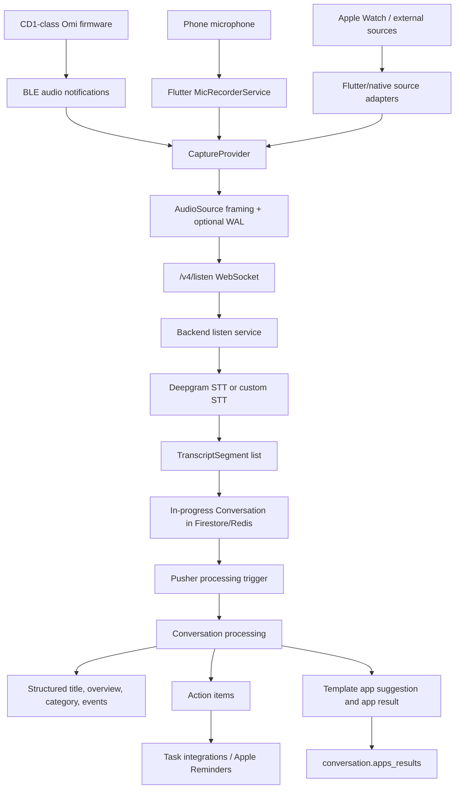
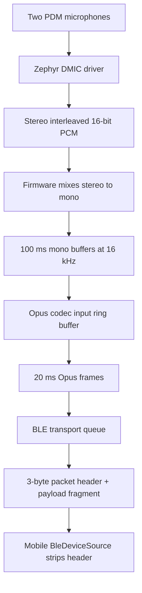

# Omi Audio, Transcription, and Template Map

This guide maps the path from captured audio to transcript, conversation, prompt-template result, action item, and external task sync. It is meant to be the working mental model for Adam's fork when changing mobile capture, CD1-class firmware behavior, backend processing, template routing, or task/reminder settings.

For normal subscription-backed work, the app should use BasedHardware's hosted backend (`https://api.omi.me`). Local backend work is useful for understanding and patching server behavior, but it is not required for daily device and app testing.

## Important Source Paths

| Area | Path | Responsibility |
| --- | --- | --- |
| Flutter capture orchestration | `app/lib/providers/capture_provider.dart` | Starts phone/device streams, opens `/v4/listen`, sends audio, handles transcript/events, WAL sync |
| Audio source framing | `app/lib/services/audio_sources/` | Converts phone mic and BLE audio into socket payloads and WAL frames |
| WebSocket client | `app/lib/services/sockets/transcription_service.dart` | Builds `/v4/listen` URL and parses transcript/message events |
| Device transport | `app/lib/services/devices/` | BLE characteristics, audio stream, codec lookup, button/storage/settings protocols |
| iOS native services | `app/ios/Runner/` | Apple Reminders, WatchConnectivity, iOS app delegate push handling |
| Backend listen route | `backend/routers/transcribe.py` | WebSocket audio ingest, in-progress conversation lifecycle, Deepgram/custom STT, pusher handoff |
| Backend pusher route | `backend/routers/pusher.py` | Processing trigger, realtime integrations, audio chunk sync, conversation completion callback |
| Conversation processing | `backend/utils/conversations/process_conversation.py` | Structuring, discard logic, app/template execution, memories, task extraction/sync |
| LLM prompts | `backend/utils/llm/conversation_processing.py` | Structure prompt, action item prompt, app result prompt, app suggestion prompt |
| Conversation models | `backend/models/conversation.py`, `backend/models/structured.py`, `backend/models/app.py` | Stored conversation, structured summary, action items, events, template app model |
| CD1-class firmware | `omi/firmware/omi/src/` | Microphone capture, Opus encoding, BLE transport, offline storage |
| Hardware docs | `docs/doc/hardware/consumer/electronics.mdx` | Consumer hardware components and mainboard notes |

There is no exact `CD1` string in the repo. The consumer Omi firmware under `omi/firmware/omi` is the CD1-class path for this map.

## End-To-End Flow



## Capture Sources

### Phone Microphone

The phone mic path starts in `CaptureProvider.streamRecording()`.

1. The app requests microphone permission.
2. It sets the recording profile to PCM16, 16 kHz.
3. `ServiceManager.instance().mic.start()` opens a `FlutterSoundRecorder` stream.
4. Raw mic chunks flow through `PhoneMicSource`.
5. `PhoneMicSource` buffers into fixed 320-byte frames, which is 10 ms at 16 kHz mono, 16-bit PCM.
6. The bytes are sent to the live socket when connected and optionally written to the local WAL.

Phone mic socket payloads are raw PCM frames. Their WAL sync key is a one-byte frame index created locally by the app.

### BLE Device Audio

The BLE path starts in `CaptureProvider.streamDeviceRecording()`.

1. The app connects to the Omi service and subscribes to the audio data characteristic.
2. It reads the audio codec characteristic.
3. For Omi/OpenGlass devices, it creates a `BleDeviceSource`.
4. Firmware audio notifications include a 3-byte BLE transport header.
5. `BleDeviceSource` strips that header before sending the socket payload.
6. The same header becomes the WAL sync key, so uploaded recovery frames can be reconciled against frames already sent live.

Important BLE UUIDs in the mobile code:

| Characteristic | UUID | Meaning |
| --- | --- | --- |
| Omi audio service | `19b10000-e8f2-537e-4f6c-d104768a1214` | Primary audio BLE service |
| Audio data stream | `19b10001-e8f2-537e-4f6c-d104768a1214` | Notified audio bytes |
| Audio codec | `19b10002-e8f2-537e-4f6c-d104768a1214` | Codec ID read by the app |
| Button | `23ba7924-0000-1000-7450-346eac492e92` | Button events |
| Storage | `30295780-4301-5d6b-b67d-84dc9102808a` | Offline storage protocol |

### WAL And Recovery

The WAL is the mobile app's local capture safety net. It matters when:

- The socket is disconnected.
- The Omi/OpenGlass stream uses Opus.
- Unlimited local storage is enabled.

Live bytes still go to `/v4/listen` when connected. WAL frames are retained with sync keys, then later uploaded to the conversation with `uploadLocalFilesV2(..., conversationId: ...)` after the backend announces or returns the conversation ID.

This is why the app has two parallel responsibilities during capture:

- Keep the live transcription socket fed with audio.
- Preserve enough frame identity locally to recover gaps or whole sessions.

## CD1-Class Firmware Audio Path

The consumer firmware path is under `omi/firmware/omi/src/`.



Key details:

- `mic.c` configures 16 kHz, 16-bit, two-channel PDM capture.
- Firmware mixes stereo to mono before encoding.
- `config.h` sets `MIC_BUFFER_SAMPLES` to `1600`, which is 100 ms at 16 kHz.
- Opus packaging uses `CODEC_PACKAGE_SAMPLES` of `320`, which is 20 ms at 16 kHz.
- Current firmware defines `CODEC_ID` as `21` for Opus, which the app maps to `BleAudioCodec.opusFS320`.
- BLE notification payloads prepend a 3-byte header: packet ID low byte, packet ID high byte, packet fragment index.
- If no BLE connection exists and offline storage is available, firmware packs Opus frames into 440-byte records for later sync.

One doc mismatch to keep in mind: `docs/doc/developer/Protocol.mdx` documents Opus codec ID `20`, while the current firmware uses ID `21` and the app knows that as `opusFS320`.

## Backend Listen Service

Mobile opens `/v4/listen` through `TranscriptSegmentSocketService.create()`.

The URL includes capture and processing settings:

- `language`
- `sample_rate`
- `codec`
- `uid`
- `include_speech_profile`
- `stt_service`
- `conversation_timeout`
- `source`
- optional `custom_stt=enabled`
- optional `onboarding=enabled`
- `speaker_auto_assign=enabled`
- optional `vad_gate=enabled`

On the backend, `backend/routers/transcribe.py` handles the WebSocket.

1. It validates the Firebase user and subscription/trial rules.
2. It creates or resumes an in-progress conversation.
3. It stores conversation state in Firestore and Redis.
4. It decodes incoming audio as needed.
5. It sends audio to Deepgram unless custom STT mode is enabled.
6. It converts STT results into `TranscriptSegment` objects.
7. It writes updated transcript segments back to the conversation.
8. It sends transcript updates back to the app.
9. It forwards audio/transcript events to pusher when pusher is available.

For custom STT, the app sends JSON `suggested_transcript` messages instead of relying on Deepgram. The backend still uses those suggested segments to maintain the same conversation and processing pipeline.

Conversation processing is not performed inside the live listen loop. The listen service marks a conversation ready and asks pusher to process it.

## Processing Lifecycle

The in-progress conversation is processed when the capture session times out, when the app manually forces processing, or when a session transition requires it.

The important mobile trigger is `CaptureProvider.forceProcessingCurrentConversation()`, used by the capture UI when stopping a current conversation. It finalizes WAL state, calls the backend process endpoint, receives a conversation ID, and then tries to sync unsynced WAL files.

The important backend flow is:

1. Listen service sets status to `processing`.
2. Listen service sends a pusher process request.
3. Pusher loads the conversation and calls `process_conversation()`.
4. `process_conversation()` creates structured content, task data, app/template results, memories, vectors, and integration side effects.
5. Conversation status becomes `completed`.

The default mobile silence timeout is 120 seconds (`conversationSilenceDuration`). The backend also enforces a minimum normal conversation timeout of 120 seconds.

## Structured Conversation Data

The backend first turns transcript/photos into a `Structured` object:

| Field | Meaning |
| --- | --- |
| `title` | Short title, no more than about 10 words |
| `overview` | Summary of the conversation or observed scene |
| `emoji` | Visual label |
| `category` | One of `CategoryEnum` values such as `work`, `business`, `technology`, `health`, `personal`, `other` |
| `events` | Confirmed future events with timing |
| `action_items` | High-confidence tasks for the primary user |

This structured data is the first major routing layer. Template selection does not inspect every raw transcript token directly. It asks the LLM to choose apps from the structured title, category, overview, action items, events, and each app's description/prompt.

## Templates Are Omi Apps

In the mobile app, a user-created template is created by `CreateTemplateBottomSheet`.

The template becomes an Omi `App` with:

- `capabilities: ['memories']`
- `category: 'conversation-analysis'`
- `memory_prompt: <the user-entered template prompt>`
- `description: <AI-generated from name and prompt>`
- `private: true` by default unless published

During conversation processing, `_trigger_apps()` decides which memory app to run.

Selection order:

1. If a specific `app_id` is passed for reprocessing, run that app.
2. Else, if Redis has a user preferred app, run that app.
3. Else, if the conversation does not already have suggested apps, call `get_suggested_apps_for_conversation()`.
4. Save up to three suggested app IDs on `conversation.suggested_summarization_apps`.
5. Run the first suggested app by default, or up to `CONVERSATION_SUMMARIZED_APP_RUN_LIMIT` suggestions when that backend environment variable is set.
6. Store the output in `conversation.apps_results`.

This is a crucial behavior: automatic processing runs one selected memory app by default, not every matching template. The backend now has a guarded multi-template path through `CONVERSATION_SUMMARIZED_APP_RUN_LIMIT`, capped at three suggested apps.

## How To Make Templates Route Well

Because automatic routing uses structured data plus app metadata, templates work best when both the description and prompt are discriminative.

Good template metadata should answer:

- What kind of conversation is this for?
- What should the output format be?
- What signals should make this app relevant?
- What signals should make this app irrelevant?

Example routing-focused template prompt shape:

```text
Use this only for sales discovery calls, customer interviews, or prospect qualification conversations.
If the transcript is not about a customer, buyer, sales opportunity, product evaluation, or procurement decision,
return "Not applicable".

Extract:
- Customer pain
- Current workflow
- Buying criteria
- Decision makers
- Budget or timing signals
- Follow-up questions
```

For deterministic routing, the current codebase needs one of these mechanisms:

- Set a preferred memory app for the user before processing.
- Reprocess a conversation with a specific `app_id`.
- Add a new rules layer that maps category/source/calendar/person/keywords to an app ID before the suggestion LLM runs.

Without that extra rules layer, automatic selection is useful but probabilistic.

## Frontend Work/Personal Template Router

Adam's fork includes a local mobile router that sits after BasedHardware's hosted backend has finished capture,
transcription, and conversation processing.

The router does not disable hosted backend template processing. Instead, it treats the backend result as the fallback
and optionally generates a local overlay summary through the hosted test-prompt route:

`POST https://api.omi.me/v1/conversations/{conversation_id}/test-prompt`

The mobile implementation lives in:

| Path | Responsibility |
| --- | --- |
| `app/lib/services/frontend_template_router.dart` | Local config/result models, work/personal schedule selection, prompt composition, cache hashing |
| `app/lib/pages/settings/frontend_template_routing_settings_page.dart` | Profile settings for enabling the router, work hours, and prompt bodies |
| `app/lib/pages/conversation_detail/conversation_detail_provider.dart` | Loads cached routed summaries and calls `/test-prompt` for completed conversations |
| `app/lib/pages/conversation_detail/widgets.dart` | Displays the routed summary before backend app results when routing is enabled |

Default routing config:

- Disabled by default.
- Work profile is Monday-Friday, 08:00 inclusive through 17:00 exclusive.
- Conversations exactly at 17:00 route to personal.
- Conversation `startedAt` is preferred; `createdAt` is the fallback.
- Both work and personal prompts are required before enabling routing.
- Routed summaries are cached locally by conversation ID, profile, conversation start time, prompt hash, and routing
  schedule. Changing the prompts or work hours invalidates the cached overlay.

This is the safest current way to get deterministic workday vs after-hours behavior while still using the subscription
backend for auth, storage, transcription, and LLM execution.

## Action Items And Apple Reminders

Action items are extracted separately from prompt-template app results. They are part of `Structured.action_items`, not `apps_results`.

The backend extractor is intentionally conservative. It asks for concrete, important, future-oriented tasks with timing signals, and it deduplicates against related open tasks. After extraction, `_save_action_items()` writes action items to the action item collection and calls `auto_sync_action_items_batch()`.

Task sync behavior:

1. Backend checks the user's default task integration.
2. If the default integration is `apple_reminders`, backend checks `auto_export_enabled`.
3. If enabled, backend marks items as `sync_requested` and sends a silent push to the iOS app.
4. iOS receives the push in `AppDelegate`.
5. Native `AppleRemindersService` creates or updates reminders through EventKit.
6. The Dart sync service can later reconcile title, due date, completion, deletion, and exported IDs.

The current app already has an Apple Reminders auto-export toggle:

- Preference key: `appleRemindersAutoExportEnabled`
- Dart default: `false`
- Native iOS default if unset: `false`
- Backend default if unset: disabled
- Settings UI: `app/lib/pages/settings/task_integrations_page.dart`
- Provider: `app/lib/providers/task_integration_provider.dart`
- Native EventKit bridge: `app/ios/Runner/AppleRemindersService.swift`

For Adam's "too many things in Reminders" issue, the relevant controls are:

- Turn off Apple Reminders auto export.
- Remove Apple Reminders as the default task integration.
- Add source names such as `desktop` or `screenpipe` to the backend integration field `auto_export_disabled_sources`.
- Tighten backend extraction rules or add a per-conversation/task review gate.
- Add a source-aware rule so certain capture sources do not auto-export tasks.

## Conversation Sources

The backend model recognizes these conversation sources:

`friend`, `omi`, `fieldy`, `bee`, `plaud`, `frame`, `friend_com`, `apple_watch`, `phone`, `phone_call`, `desktop`, `openglass`, `screenpipe`, `workflow`, `sdcard`, `external_integration`, `limitless`, `onboarding`, and `unknown`.

Source affects capture framing, backend decoding, meeting detection, subscription/trial behavior, and downstream analytics. It is also a good future routing signal for templates.

## High-Value Future Improvements

These are the changes most likely to make Omi behave the way Adam wants:

1. Promote the local router into a first-class deterministic routing system.
   Add rules beyond work hours: source, calendar meeting title/attendees, folder, category, speaker/person, keywords,
   and preferred output type.

2. Add a "run multiple templates" UI mode.
   The backend can run up to three suggested apps through `CONVERSATION_SUMMARIZED_APP_RUN_LIMIT`, but the app still needs a user-facing setting and clearer controls.

3. Add per-source task export controls.
   Example: desktop conversations can create action items but not export to Reminders; Omi device conversations can require review; explicit phone recordings can auto-export.

4. Build a source-control UI for task export.
   The backend can skip auto-export by source through `auto_export_disabled_sources`, but the iOS settings UI still needs a picker for sources.

5. Add deterministic template rules.
   Use source, calendar meeting title/attendees, folder, category, speaker/person, keywords, and preferred output type before the suggestion LLM runs.

6. Expose template execution mode in the mobile app.
   A useful setting would let Adam choose first suggestion, top two, top three, preferred app only, or manual review.

## Mental Model

Think of Omi as four distinct systems:

1. Capture system: device/phone/native audio into normalized frames.
2. Transcript system: live socket, STT, diarized transcript segments, in-progress conversation.
3. Understanding system: structured summary, category, events, action items, memories.
4. Routing system: task integrations, Apple Reminders, prompt-template apps, external integrations.

Templates sit in the routing system, but they depend heavily on the understanding system. If the structured summary/category/action items are wrong, template selection will be wrong. If the app description and prompt are too generic, selection will be inconsistent. If deterministic behavior matters, add deterministic routing before the LLM selector.
